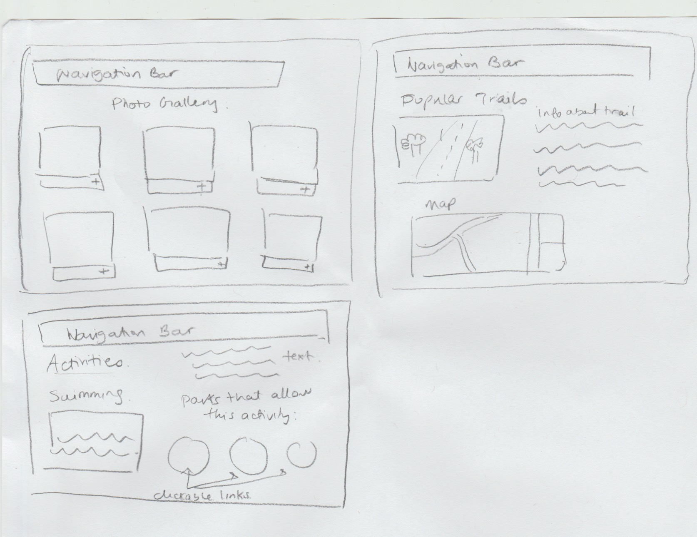
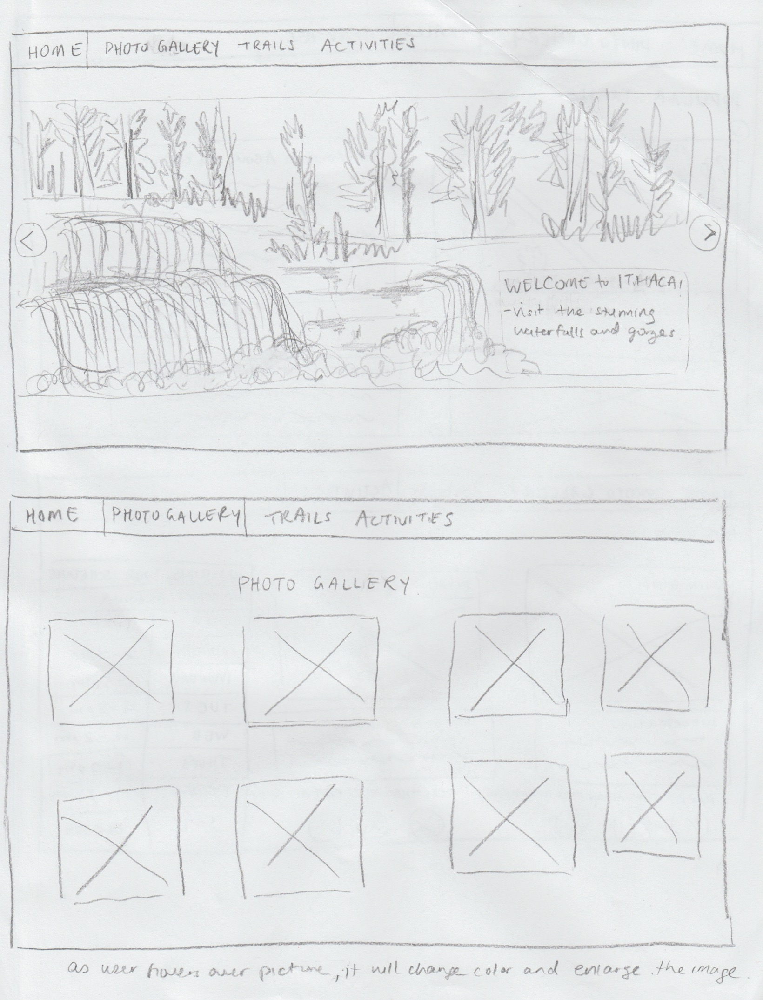
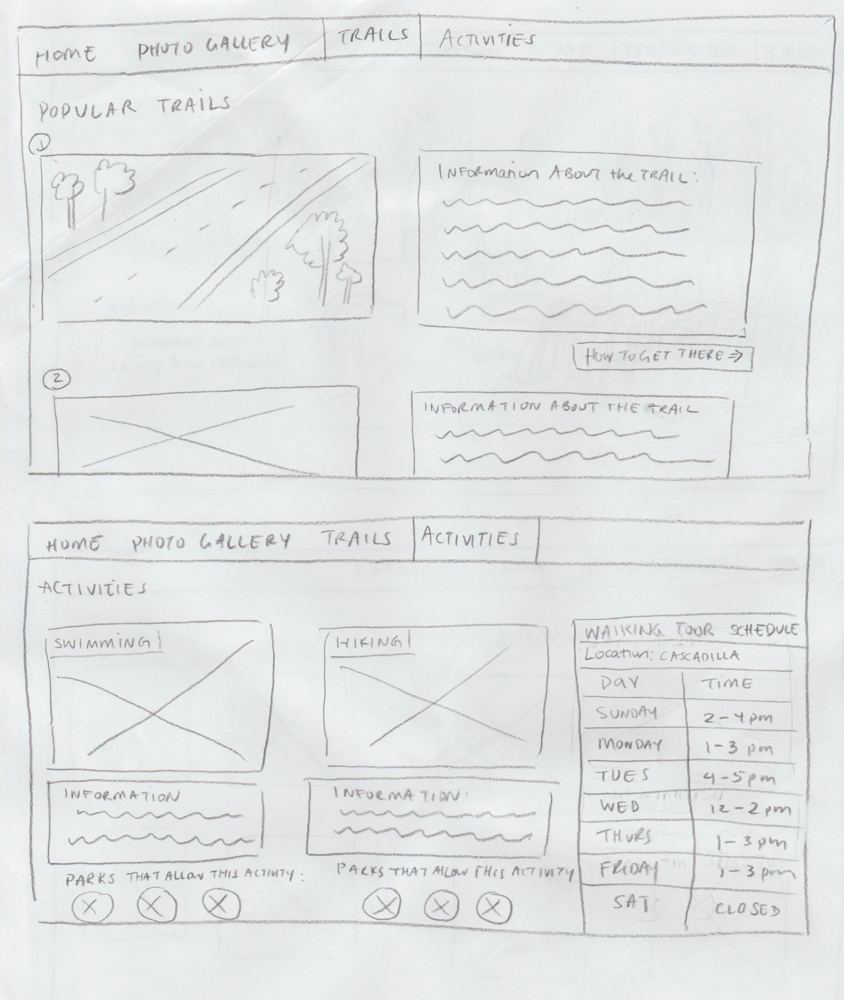

# Project 1, Milestone 1 - Design & Plan

Your Name: Aileen Cai

## 1. Persona
I've selected **Abby** as my persona.

I've selected my persona because her motivations and attitudes toward technology is parallel to mine. My information processing style is also "burst-y" so I feel that our similarities would help me design a webpage that would be more user friendly to her.

## 2. Sketches

[2. Create some sketches to generate ideas about a website design that would work for your persona.]

My sketches meet the need of my personal because it is simple and intuitive. Since Abby is risk averse and has low confidence about doing unfamiliar tasks, I decided to place the navigation bar at the top where is easily accessible. The layout of the page is also concise and have no hidden links.

## 3. Wireframes

[3. Author detailed wireframes that will become the design that you program for the final milestone.]

## 4. Coding Plan & Pseudocode

[4. Author a plan for how you will code your PHP website.]

I will create 4 php pages (home.php, photos.php, trails.php, activities.php) and two javascript files for the slideshow in home.php and photos.php. Each page will have a navigation bar that will use a PHP includes file and a footer for contact information with a header php file. The init.php file will include an array of all the pages I plan on including. In my activities.php file, I will include an array for the schedule and a for loop to return the information. In my trails.php file, I will use a user defined function to echo details about the location.

[Make sure you layout how to you plan to use PHP *includes*.]

I will use php includes for the navigation bar, page array and footer. Each file would contain an id assigned to a variable (current_page) and the php includes(init.php) would contain the array of all the pages.In the body of my file, I would add php includes(header.php) for the navigation bar. In my header.php, I will create a for loop that returns the hyperlink of the page based on its assigned id. At the end of my pages, I will add php includes(footer.php) to include contact information in my footer.

[Write your pseudocode for your user defined function.]

User defined function will be in trails.php and activities.php.

assign array of elements to a variable called $info
make a function called print_info with $an_info as a parameter.

echo a list element of $an_info

In the body:
create a foreach loop instead of repeating codes.
In the for each loop, set the variable of the array ($info) to a key called $i, then print the key $i

In activities.php:
assign array of elements (days) to a variable called $week

make a function called print_schedule with $day as a parameter/key.

inside the function, create an array with details of each day, assign the array to a variable called $time.

create a conditional that prints/echo the time to each corresponding day.
